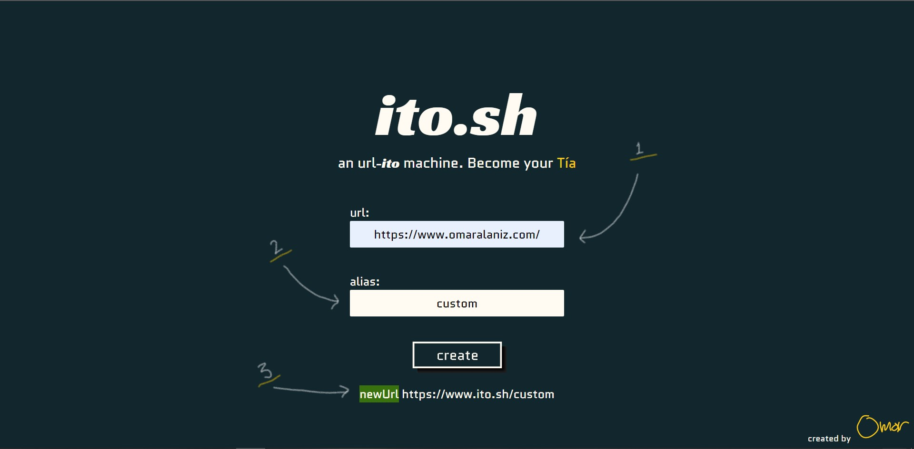
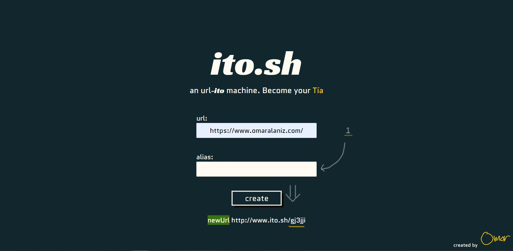
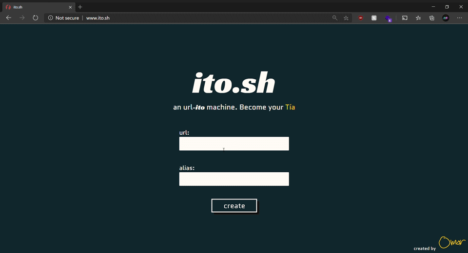

  

<h1 align="center">ito.sh</h1>

---

 Few lines describing your project.
      

## 📝 Table of Contents

- [About](#about)
- [Built Using](#built_using)
- [Usage](#usage)
- [Deployment](#deployment)
- [System Design](#system_design)
- [Authors](#authors)
- [Acknowledgments](#acknowledgement)

## 📟 About 

Write about 1-2 paragraphs describing the purpose of your project.

## ⛏️ Built Using 

- [MongoDB](https://www.mongodb.com/) - Database
- [Node.js](https://nodejs.org/en/) - Server Environment
  - [Express](https://expressjs.com/) - Server Framework
  - [monk](https://automattic.github.io/monk/) - MongoDB driver for Node.js
  - [yup](https://github.com/jquense/yup) - Object validator
  - [nanoid](https://github.com/ai/nanoid) - ID generator
- [VueJs](https://vuejs.org/) - Web Framework

## 🔑 Usage 

1) Type in the URL that you want to shorten
2) Type in custom alias you want to use
3) New shorten URL copy and you can start using it!  
❌ **if custom alias is taken it will warn you!**
4) If user does not want to use a custom URL leave alias input blank and it will generate one for you!

1) The input for alias was left blank and it created a random alias for the user

### **Full Run Through**

## 🚀 Deployment 
I am utilizing AWS services for deployment and continous delivery 
The services I am uing are:

- [AWS Elastic Beanstalk](https://aws.amazon.com/elasticbeanstalk/) - Deployment
- [AWS CodePipeline](https://aws.amazon.com/codepipeline/) - Continous Delivery

## 🏭 System Design 

## ✍️ Authors 

- [@omaralaniz](https://github.com/omaralaniz) - Idea & Initial work

## 🎉 Acknowledgements 

- Inspiration - [@CodingGarden](https://github.com/w3cj)
